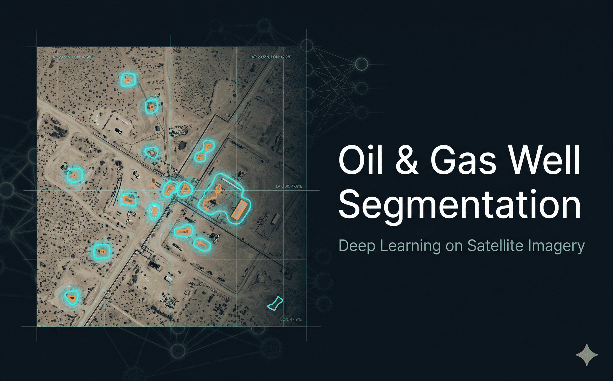

# PyTorch Lightning Segmentation with MLOps

A production-ready GitHub repository for training image segmentation models using PyTorch Lightning. Features include a customizable ResUNet architecture, combined Focal + Dice Loss, F1 and Dice metric tracking, and built-in support for Multi-GPU (DDP) and Mixed Precision (AMP) training.

## 🚀 Key Features
- **PyTorch Lightning**: Automated validation, logging, and hardware routing.
- **Hydra + Pydantic**: Hierarchical configuration natively validated via strict Python schemas.
- **DDP & AMP**: Easily scale to multiple GPUs and use FP16 for faster training.
- **Metrics & Losses**: Built-in support for `torchmetrics` and combined Focal + Dice loss dynamically weighted.
- **GitHub Actions CI**: Automated formatting and testing standardizing code checks.

## 📦 Installation

Clone the repository and install it in editable mode:
```bash
git clone <your-repo-url>
cd repo
pip install -e .
```
For development tools (pytest, black, isort):
```bash
pip install -e ".[dev]"
```

## 🧠 Configuration Structure

All hyperparameters are controlled strictly through `configs/config.yaml`. The schema is defined and validated in `src/config/schema.py`.

```yaml
training:
  lr: 1e-3
  batch_size: 8
  epochs: 50
  use_amp: true
  use_ddp: true
  num_gpus: 2
# ... (see configs/config.yaml for more)
```

## 🏋️ Training the Model

By default, simply run:
```bash
python train.py
```

### Overriding Hyperparameters (CLI)
You can dynamically override hyperparameters using Hydra syntax without modifying the YAML file:
```bash
# Change learning rate and batch size
python train.py training.lr=1e-4 training.batch_size=16

# Change the loss weights
python train.py loss.dice_weight=0.5 loss.focal_weight=1.5
```

### Using Distributed Data Parallel (DDP)
DDP is controlled natively via configuration. To train on 2 GPUs using DDP:
```bash
python train.py training.use_ddp=true training.num_gpus=2
```
If you encounter memory issues, you can disable it:
```bash
python train.py training.use_ddp=false training.num_gpus=1
```

### Automatic Mixed Precision (AMP)
Train with 16-bit mixed precision for substantial memory savings and speedups on modern Tensor Cores:
```bash
python train.py training.use_amp=true
```

## 🧪 Testing

Run the local test suite using `pytest`:
```bash
pytest tests/
```
The CI pipeline on GitHub Actions automatically runs `pytest` and `black --check .` on every push and PR to `main` or `dev`.

## 📁 Repository Structure
See `src/` for source code, `configs/` for YAML configuration, and `tests/` for validation logic.
